Ethan Schledewitz-Edwards 100908840  
Andrew Hoult 100866035  
Zachary O’Brien 100909491

# CG Course Project Read Me

Youtube link:   
Github link: [https://github.com/mrrobottrax/ShaderAssignment1](https://github.com/mrrobottrax/ShaderAssignment1)  
Slideshow: [https://docs.google.com/presentation/d/1bvJlF9zJBGLmlyUTeOlo\_qiaIxlgur4HBnL0GNMcjc4/edit?usp=sharing](https://docs.google.com/presentation/d/1bvJlF9zJBGLmlyUTeOlo_qiaIxlgur4HBnL0GNMcjc4/edit?usp=sharing)

Note: Our multiplayer implementation requires that the user has Steam installed and running in order to work properly, whether in the Unity editor or a built version of the project.

# **Improvements**

Since the last iteration of our GDW game, we have implemented numerous gameplay and graphical improvements. These updates aim to better capture a retro PC-game aesthetic, inspired by titles like *Half life, Quake, Morrowind*, and *Silent Hill* while also creating a more immersive and cohesive game world. This provides a strong foundation for testing our core gameplay loop. In the following sections, we will outline the key updates made to our deliverables.

The most significant change was our switch from Unity’s Universal Render Pipeline (URP) to a custom Scriptable Render Pipeline (SRP). This transition gave us extensive customization options for our game's visual style. However, a side effect of this change was the loss of support for Shader Graph. Rather than recreating our previous node-based shaders in HLSL, we focused on designing new shaders that better align with the current needs of our GDW game. Since the last iteration of our project, our GDW team has re-scoped and re-designed many portions of our game, hence why some shaders are replaced rather than iterated on.

The shaders that were replaced include the ghost shader, flame shader, and stencil shader. In their place, we developed a dynamic skybox shader, water shader, scrolling cloud shader, triplanar shader, decal shader, and most importantly, a custom render pipeline that is composed of various other shaders. These new additions and their details are outlined below.

## **Scriptable Render pipeline**

(Assets/Code/CustomRP)

Our custom rendering pipeline uses a deferred shading model with volumetric shadows. This allows us to render crisp, retro looking shadows with high performance when using many realtime shadow casting lights. This fits our artstyle and game requirements, as our game features dark underground mines that the players must light themselves.

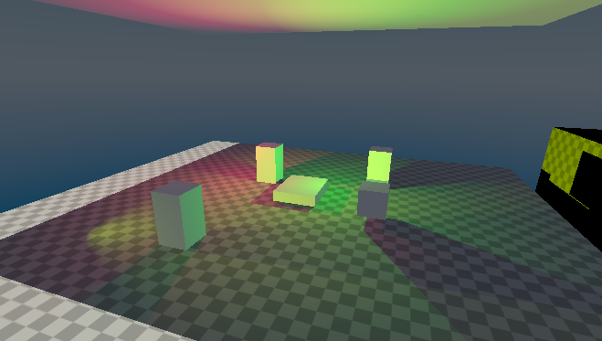  

### **GBuffer**

The GBuffer consists of an albedo buffer, a world space normal buffer, and a world space position buffer. The alpha channel of the albedo buffer is used to specify how much ambient light a surface receives. This allows us to make the mines pitch black when receiving no light.

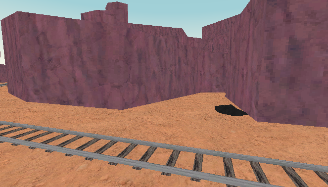  
  
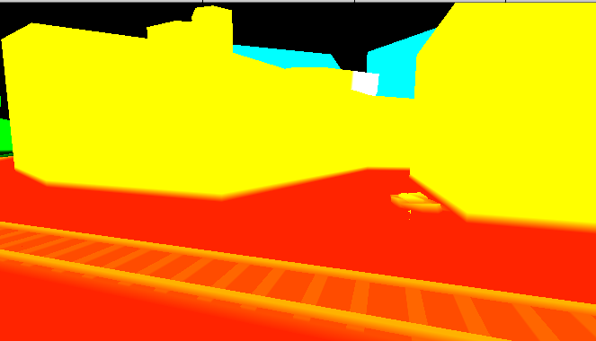  

### **Shadows**

Shadows are calculated by extruding the geometry away from the light. This is accomplished by using a geometry shader (Assets/Code/CustomRP/Shaders/Include/ShadowUtil.hlsl).

  
(a resulting shadow volume from the sun)

The extruded geometry is rendered with special stencil buffer properties. On depth fail, the stencil buffer is incremented when rendering backfaces, and decremented when rendering frontfaces. This results in the stencil buffer being 0 in all areas that receive direct illumination.

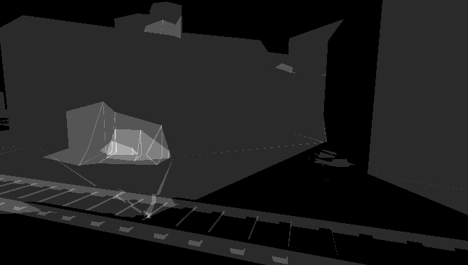  
(the stencil buffer representing shadows, overlapping shadows result in a value greater than 1\)

### **Lighting**

Lighting is calculated by rendering shadows to the stencil buffer, then summing light to the colour buffer only in areas that receive light. The directional light has an additional pass where it adds ambient light to shadows.

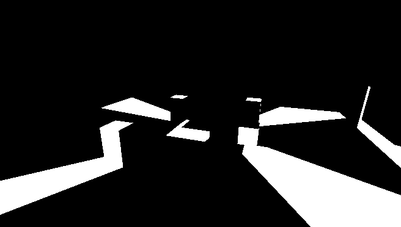  
(shadows calculated from a point light)

The shader responsible for lighting is “Assets\\Code\\CustomRP\\Shaders\\DeferredLighting\\DeferredLighting.shader”.

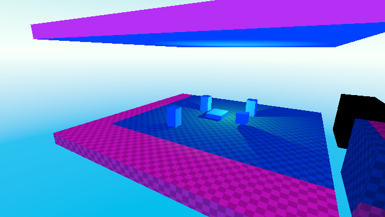  
(an illustration of the directional light colour and the shadow colour)

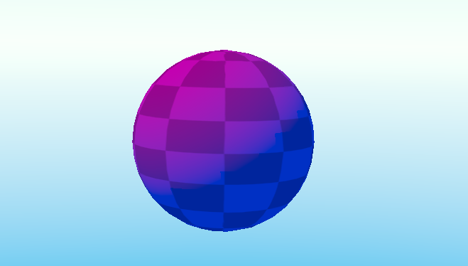  
(lambertian lighting blends between the light colour and the shadow colour)

### **Lighting Stages Illustration**

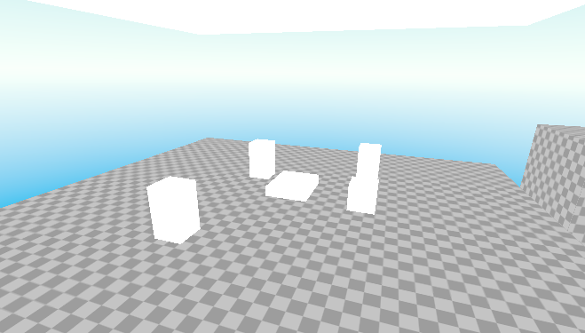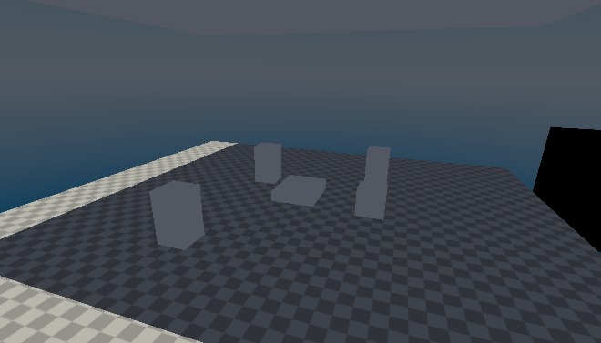  
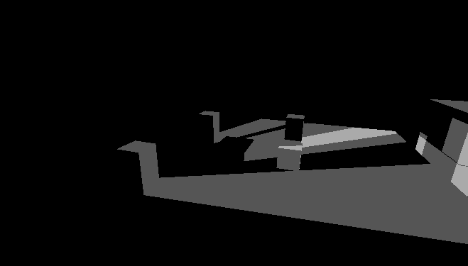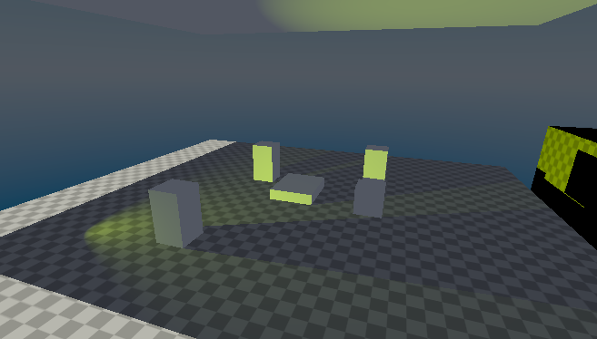  
  
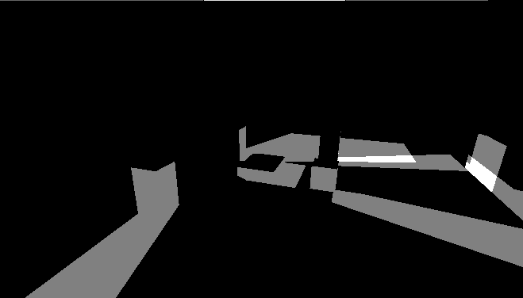  

### **Transparency**

  

We implement transparency by running a quick forward pass after deferred lighting, sorting objects by depth for proper blending.

### **Previous Shaders**

We have deferred versions of all our previous shaders, including fullbright, diffuse lighting, specular lighting, and diffuse \+ specular lighting. Switching these modes now affects the entire scene rather than one object.

  
(specular only mode)

##  **Train**

One of the key gameplay features of our GDW project is a physically simulated train that follows splines to transport players to and from various maps within the game. The train will initially drop players off before departing, but it will return periodically throughout the day, allowing players to buy and sell items.

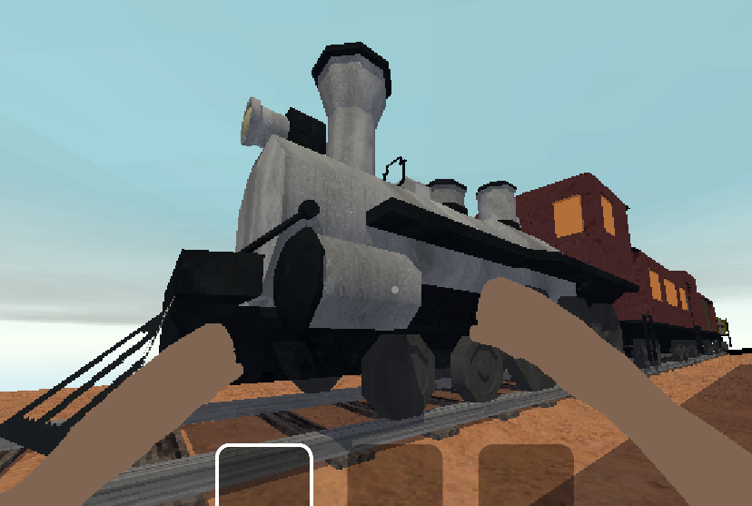  

## **Day and night cycle**

The backend for the day-night cycle has been implemented into our game. This system advances the in-game days, and after three days have passed, players must meet the profit quota using the resources they have acquired from the mines. Additionally, we plan to add logic for the train, which will arrive at 8 AM and depart at 10 AM daily, providing players an opportunity to restock their supplies each morning.

Additionally, we have created a custom procedural skybox shader and included a dynamic clock in the UI to help visualise the change in time over the course of the day.

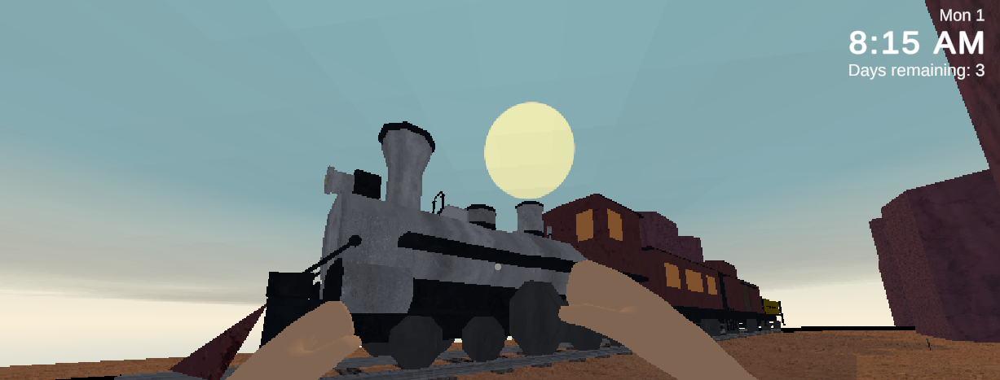  
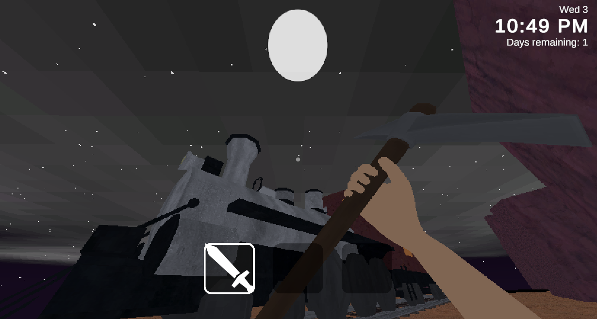  

## **Sound effects**

Our game features different footstep sounds that play depending on the surface type the player is walking on. We also have sounds for striking ore.

## **Scene**

Over the past few weeks, we have worked hard to create a more finalised scene that enhances our game’s retro graphical style and provides a clearer sense of how the final product will play. This scene is set on a cliffside towering above the desert, with a mine nestled within a canyon adjacent to the players' train drop-off point. The design features two train tunnels on opposite sides of the map, through which the train enters and exits, transporting players to and from the area.

  
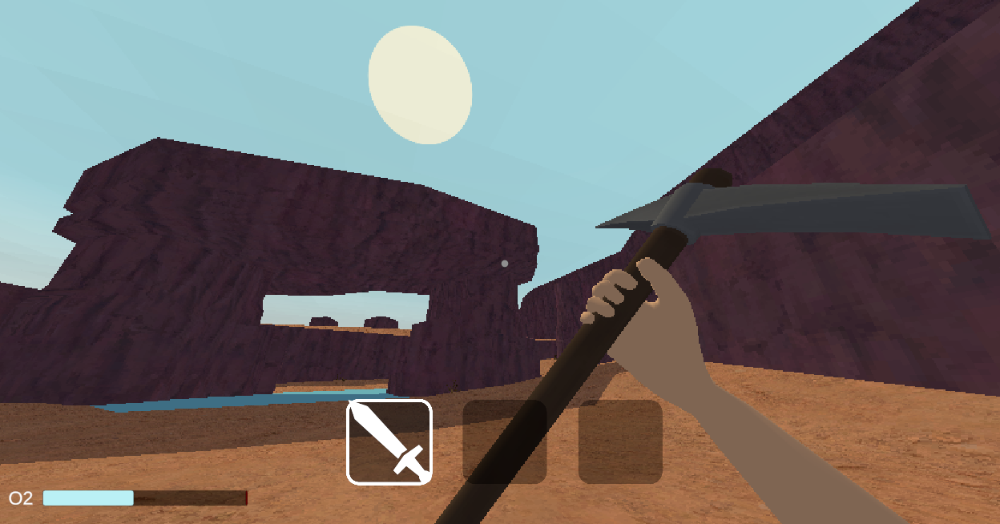  

## **LUTs**

(Assets\\Code\\CustomRP\\Shaders\\PostProcessing\\LUT.shader)

Many improvements have been made to the LUT shader. The LUT is now represented with a 3D texture so that blending can be more accurate. The LUTs themselves have been adjusted. The system still allows for LUT blending and transitions. Overall, the new shader provides much better results.

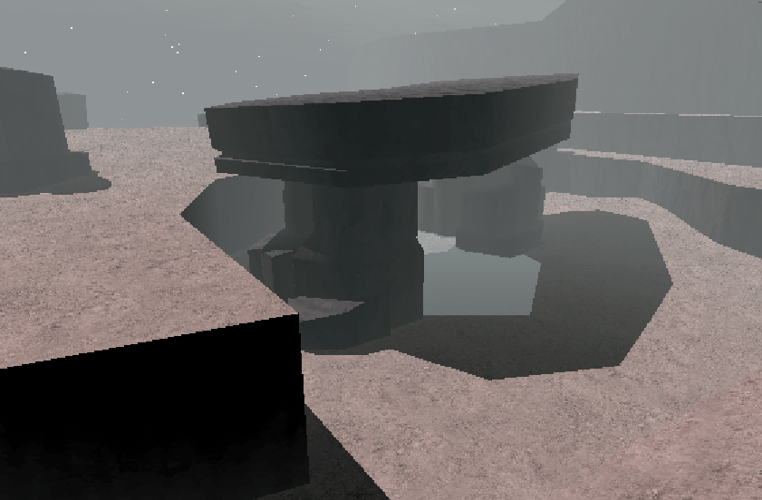  

# **Texturing** 

As mentioned in our previous submission, graphically, our game is heavily inspired by early 3D games such as *Half life* and *Silent Hill*. Because of this choice, we have opted to use intentionally low resolution textures, most of which are real-life photos scaled down. Photo Texturing is how many of the textures were created for the original *Half-Life* and we felt using the same method would be the best course of action to achieve the same graphical style. We used point sampling for all textures.

##  **Hand Mapped Textures**

Since our last update, new assets have been created, with all of the ones currently present in the scene being textured. assets have been prototyped, modelled, uv unwrapped, and textured.

Train Ore Cart:  
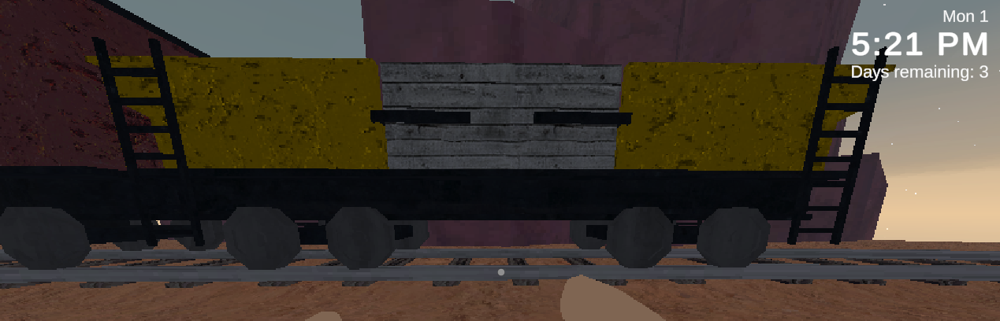  

### **Texture format**

To best suit our game, we determined early on that we will be using texture atlases. Texture atlases are lager textures comprised of smaller textures:

Steam engine texture atlas:  
  

**UV unwrapping** 

For assets such as the train, items, and foliage, we UV unwrapped our models manually using *Blender*. From here, we took our faces, and moved them to parts of the texture atlas that made sense. To streamline the unwrapping process, seams were defined on each mesh so that faces would be grouped together to ensure that the textures are smooth and don't change abruptly with each face.  
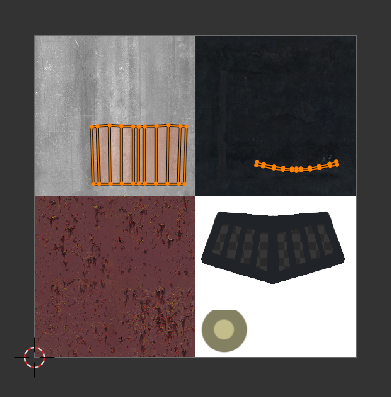  

Seams help *Blender* understand which parts of a mesh are grouped together by checking which faces are separated by edges marked as “seams.”

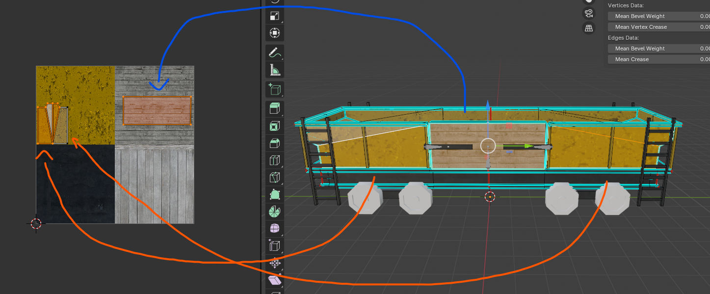  

## **Triplanar Shader Textures**

To handle the geometry found within our procedurally generated mines, and for ease of terrain creation, we have created a triplanar variant of the default lit shader.

This variant calculates UV coordinates for texture sampling using the world space position and world space normal of the fragment. The plane that most closely matches the normal vector is used. This is different from some other triplanar implementations that blend between 3 samples using the 3 planes. We chose a more discrete method because soft blending would look out of place in our sharp and crispy artstyle.

There is also a variant of this shader that rotates the triplanar sampling by 90 degrees. This can be used to make sure that the texture properly aligns with the world.

## **Colour Palette choice**

Our game is set in a fictional western setting. As a result, we have chosen a warm colour palette with many reds, yellows, oranges and browns above ground. However, we want a bright blue sky to contrast the warm colours of the terrain. For the mines below the overworld, we aim to achieve a cold look with many dull blues and greys.

Overworld colours:  
  

Below ground colours:  
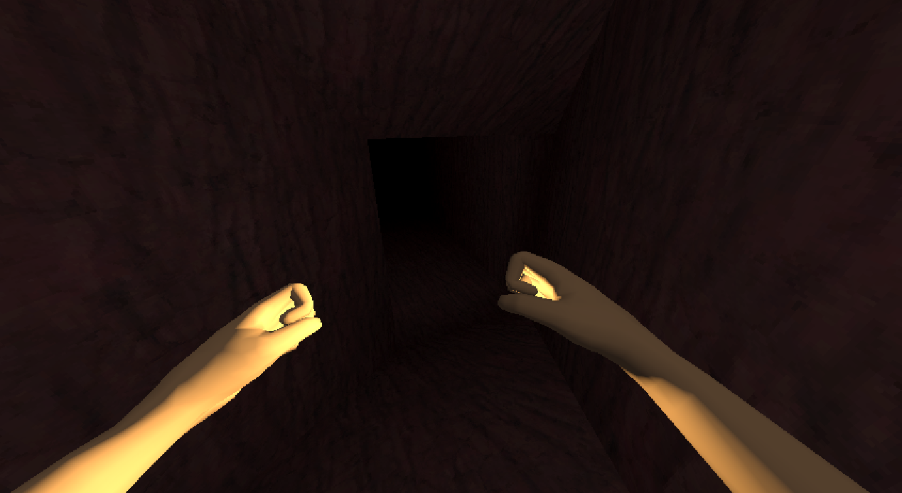  

## **How we met the texturing requirements for our group size**

Every asset in our scene is textured, as we have three members in our group. We achieved this by reducing our required asset list to only those essential for the gameplay demo and by strategically choosing which assets to manually texture and which to texture using triplanar shaders. Important assets with unique, more defined geometry, such as the train, items, and foliage, were textured by hand. In contrast, geometry with larger, more angular shapes, like the terrain, was assigned the triplanar shader, which projects textures onto the mesh based on its UVs in world space.

Top down view of scene:  
  

First person perspective  
  

# **Visual Effects**

## **Smoke**

(Assets\\Code\\CustomRP\\Shaders\\BasicShaders\\Transparent.shader)

We’ve implemented smoke using a custom transparency shader. Smoke is alpha blended based on the opacity of the texture.

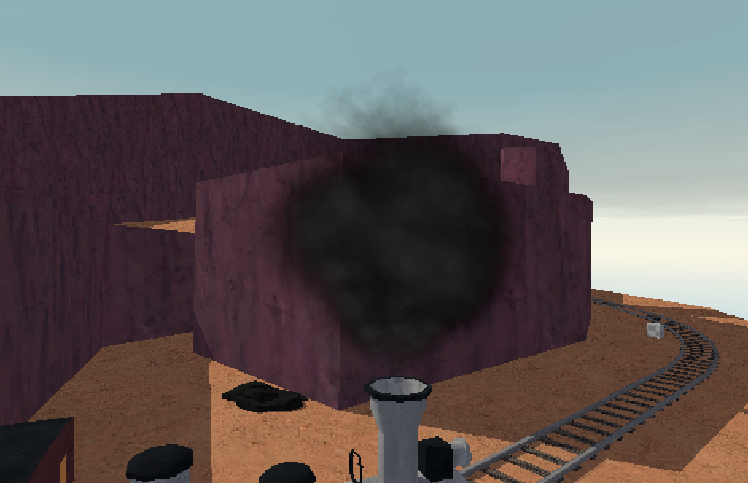  

There is an alternative shader that uses additive blending for steam. (Assets\\Code\\CustomRP\\Shaders\\BasicShaders\\Additive.shader)

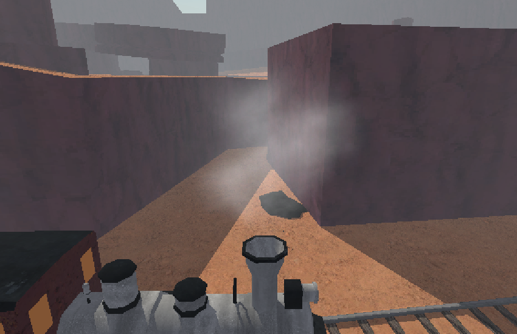  

## **Rock Debris particle system with shader**

(Assets\\Code\\CustomRP\\Shaders\\Particles\\RockPS.shader)

We added some juice from the previous interaction to the mining. Now when you hit the coal small rocks fly off. A dissolve shader supports this particle system to add a fade to the rocks before they disappear so that it is less jarring. The shader steps Perlin noise and applies it to the alpha of the rock. Before the rock disappears the shader increases the step until the rock disappears then despawns. 

## **Water** 

(Assets\\Code\\CustomRP\\Shaders\\Water\\Water.shader)

We’ve added a simple water shader for a pond. The shader is a fairly simple shader meant for small bodies of water like ponds. To achieve the desired effect the water blends two normal maps moving in different directions with different tilings and controllable strength. To match real water the surface is slightly reflective and partially transparent. 

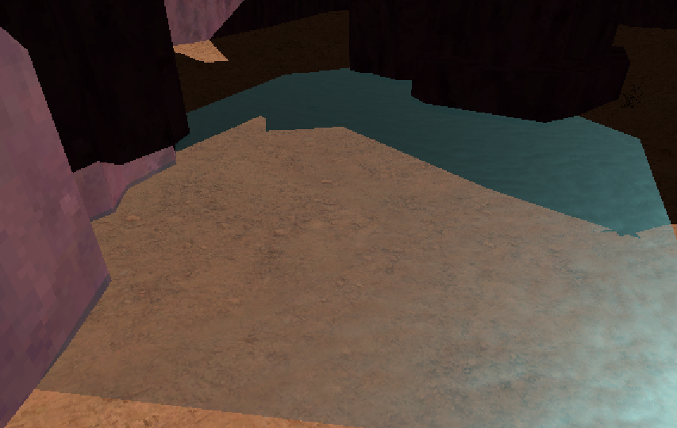  

## **Scrolling Clouds**

(Assets\\Code\\CustomRP\\Shaders\\SkyShaders\\Clouds.shader)

To add extra detail to our desert skies, we have also included a scrolling transparent cloud shader on a plane separate from the skybox. This shader includes properties for texture, tiling, colour, scroll speed on x and y, and cutoff. This shader simply scrolls the UV’s over time in the vertex shader, while the fragment shader handles the texturing, colouring, and alpha cutoff.

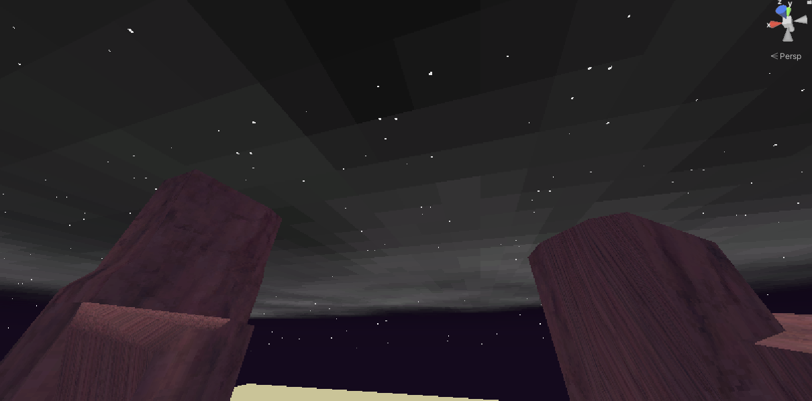  

## **Skybox**  

(Assets\\Code\\CustomRP\\Shaders\\SkyShaders\\DynamicSkybox.shader)

Since the last iteration of this project, we have added a fully dynamic skybox shader. This shader combines several components, including properties for the sun (colour, size, and texture), moon (colour, size, and texture), sky gradients (day and night transitions), stars (texture and movement), and horizon effects (intensity and colours). The vertex shader calculates world position and UVs, while the fragment shader blends these elements based on the time of day.

The shader dynamically updates as the scene's directional light moves, adjusting the sun and moon's positions, brightness, and visibility based on whether they are above or below the horizon. Day and night gradients transition smoothly using the y-axis rotation of the directional light, while stars fade in as the sun sets, and horizon effects enhance sunrise and sunset visuals. This system ensures the skybox responds to changes made to the sun's rotation in real time, creating natural, seamless transitions. This shader is used in conjunction with our day-night cycle system, which handles the rotation of the sun direction light that the shader updates based off of.

Sunset:  
  

High noon:  
  

## **Fog**

(Assets\\Code\\CustomRP\\Shaders\\DeferredLighting\\Fog.shader)

We implemented a fullscreen post-processing pass to achieve a radial fog effect. It renders using the position buffer, and can somewhat handle transparent objects (it uses the position of the opaque object behind it, this will change if it becomes an issue).

  

The colour, start and end distances, and opacity are all customizable.

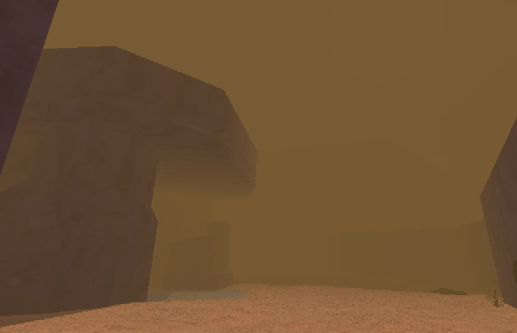  
(possible sandstorm effect)

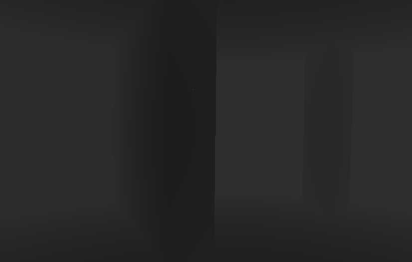  
(fog lets you see slightly in the mines)
